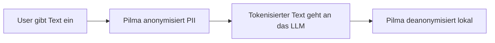

<a id="top"></a>

<div align="center">

# Pilma

**Der privacy-first PII-Firewall-Companion fuer LLM-Workflows:** localhost-only, sicherheitsbewusst und so gebaut, dass sensible Texte anonymisiert werden, bevor sie die Maschine verlassen.

[![CI][badge-ci]][ci]
[![CodeQL][badge-codeql]][codeql]
[![Scorecard Workflow][badge-scorecard-workflow]][scorecard-workflow]
[![OpenSSF Scorecard][badge-scorecard]][scorecard]
[![Node 22/24][badge-node]][package-json]
[![Localhost Only][badge-localhost]][architecture]
[![Privacy First][badge-privacy]][threat-model]
[![License Status][badge-license-status]][openssf]
[![Issues][badge-issues]][issues]
[![PRs][badge-prs]][pulls]
[![Last Commit][badge-last-commit]][commits]

Pilma schuetzt persoenliche Daten in LLM-gestuetzten UIs, indem PII vor dem Absenden durch kurzlebige Tokens ersetzt und spaeter lokal wiederhergestellt wird.
Der aktuelle Repo-Stand liefert den geharteten Companion-Service; die Browser-Extension ist in den Architektur-Dokumenten beschrieben, aber noch kein Build-Ziel dieses Repos.

[Schnellstart](#schnellstart) · [API](#api-im-ueberblick) · [Architektur](./ARCHITECTURE.md) · [Security](./SECURITY.md) · [OpenSSF](./OPENSSF.md) · [Mitmachen](./CONTRIBUTING.md)

</div>

## Inhaltsverzeichnis

- [Warum Pilma?](#warum-pilma)
- [Was heute im Repo steckt](#was-heute-im-repo-steckt)
- [Security by Default](#security-by-default)
- [Ablauf in 4 Schritten](#ablauf-in-4-schritten)
- [API im Ueberblick](#api-im-ueberblick)
- [Schnellstart](#schnellstart)
- [Projektstruktur](#projektstruktur)
- [Qualitaetsgates](#qualitaetsgates)
- [Roadmap](#roadmap-now-next-later)
- [Dokumentation und Vertrauen](#dokumentation-und-vertrauen)
- [Mitmachen](#mitmachen)
- [Lizenzstatus](#lizenzstatus)

## Warum Pilma?

Viele LLM-Workflows scheitern nicht an der Modellqualitaet, sondern an der Frage: "Wie halte ich Namen, E-Mails, IDs oder andere PII aus fremden Systemen heraus?"
Pilma beantwortet genau das mit einem klaren Architekturprinzip:

- **PII wird vor dem Versand anonymisiert**
- **Mappings bleiben nur im Speicher**
- **der Dienst bleibt standardmaessig auf `127.0.0.1`**
- **Logs und Traces enthalten keine Rohtexte und keine Roh-PII**

Das Ergebnis ist ein Baustein fuer lokale oder browsergestuetzte AI-Workflows, der Privacy und Developer-Ergonomie zusammenbringt.

[Zurueck nach oben](#top)

## Was heute im Repo steckt

Der aktuelle Lieferumfang ist bewusst fokussiert und produktnah:

- `POST /anonymize` ersetzt erkannte PII durch vault-gestuetzte Tokens
- `POST /deanonymize` stellt Tokens fuer dieselbe Session lokal wieder her
- `POST /session/reset` leert die In-Memory-Vault einer Session
- `POST /model/warmup` waermt ein konfiguriertes Modell vor, wenn es bereits gecacht ist oder Remote-Download explizit erlaubt wurde
- `GET /health` liefert den Service-Zustand

Wichtig fuer Erwartungsmanagement:

- Der **Companion-Service** ist heute der echte, gebaute Deliverable in diesem Repository.
- Die **Browser-Extension** ist architektonisch vorgesehen, aber noch nicht als fertiges Produkt im Repo enthalten.
- Modelle werden **nicht gebuendelt** und sollen nutzerseitig geladen bzw. gecacht werden.

[Zurueck nach oben](#top)

## Security by Default

Pilma ist nicht nur "privacy-themed", sondern in seinen Defaults absichtlich restriktiv:

- bindet standardmaessig an `127.0.0.1`
- verweigert Non-Loopback-Binds ohne explizites `ALLOW_NON_LOOPBACK_HOST=true`
- verlangt `X-Pilma-Secret` auf allen `POST`-Routen
- authentifiziert Requests, bevor Request-Bodies gelesen werden
- akzeptiert auf `POST` nur `application/json`
- begrenzt JSON-Request-Bodies auf 1 MiB
- speichert PII-Mappings nur im Speicher und raeumt per TTL auf
- emittiert strukturierte Traces ohne Rohtext, Roh-PII oder Secrets

Diese Regeln sind keine Randnotiz, sondern Teil des Vertrags in [SECURITY.md](./SECURITY.md), [RUNBOOK.md](./RUNBOOK.md) und [THREAT_MODEL.md](./THREAT_MODEL.md).

[Zurueck nach oben](#top)

## Ablauf in 4 Schritten



Kurz erklaert:

1. Ein Client schickt Text an den lokalen Companion.
2. Pilma ersetzt erkannte PII durch kurzlebige Platzhalter wie `§§EMAIL_1~...§§`.
3. Nur der anonymisierte Text verlaesst den lokalen Kontext.
4. Antworten koennen spaeter fuer dieselbe Session wieder deanonymisiert werden.

Mehr Kontext dazu steht in [ARCHITECTURE.md](./ARCHITECTURE.md) und [ARCHITECTURE_DECISIONS.md](./ARCHITECTURE_DECISIONS.md).

[Zurueck nach oben](#top)

## API im Ueberblick

Alle `POST`-Routen erwarten:

```text
Content-Type: application/json
X-Pilma-Secret: <shared-secret>
```

### `GET /health`

```json
{ "status": "ok", "sessions": 0 }
```

### `POST /anonymize`

Request:

```json
{ "sessionId": "demo-session", "text": "Email me at user@example.com" }
```

Response:

```json
{
  "text": "Email me at §§EMAIL_1~D2B9D7F4§§",
  "counts": { "EMAIL": 1 },
  "traceId": "trace-..."
}
```

### `POST /deanonymize`

```json
{ "sessionId": "demo-session", "text": "Email me at §§EMAIL_1~D2B9D7F4§§" }
```

### `POST /session/reset`

```json
{ "sessionId": "demo-session" }
```

### `POST /model/warmup`

```json
{ "modelId": "iiiorg/piiranha-v1-detect-personal-information" }
```

oder:

```json
{ "locale": "en" }
```

Wenn Remote-Download deaktiviert ist und kein Cache-Treffer existiert, liefert die Route bewusst einen Fehler statt still im Hintergrund nachzuladen.

[Zurueck nach oben](#top)

## Schnellstart

```bash
npm install
npm run lint
npm run typecheck
npm run build
npm test
npm run openssf:check
```

Dann den Shared Secret setzen und den Companion starten:

```bash
export SECRET='replace-with-a-long-random-shared-value'
npm run companion
```

PowerShell:

```powershell
$env:SECRET = 'replace-with-a-long-random-shared-value'
npm run companion
```

Standardadresse:

```text
http://127.0.0.1:8787
```

Der Dienst startet nur mit explizitem `SECRET` und gibt diesen Wert nicht auf stdout aus.

[Zurueck nach oben](#top)

## Projektstruktur

- `src/companion` - Companion-Service, HTTP-Endpunkte, Auth, Vault und Modellvorbereitung
- `src/tracing` - strukturierte Traces ohne Rohdaten
- `tests` - Unit- und Integrationsabdeckung fuer Server, Vault, Warmup und Konfiguration
- `ARCHITECTURE.md` - Systembild und geplanter Extension-Kontext
- `ARCHITECTURE_DECISIONS.md` - wichtige Architekturentscheidungen
- `THREAT_MODEL.md` - Risiken, Missbrauchspfade und Gegenmassnahmen
- `RUNBOOK.md` - Betrieb, Releases und Incident-orientierte Hinweise
- `OPENSSF.md` - Nachweise fuer Badge- und Scorecard-Arbeit
- `.motherlode/` - wiederverwendbare Engineering-Standards fuer Repo-Hygiene und Audits

[Zurueck nach oben](#top)

## Qualitaetsgates

Pilma haertet nicht nur den Runtime-Pfad, sondern auch die Repo-Pipeline:

- `npm run lint`
- `npm run typecheck`
- `npm run build`
- `npm test`
- `npm run openssf:check`
- GitHub Actions fuer CI, CodeQL und OpenSSF Scorecards
- Dependabot-Patch- und Minor-Updates aktivieren nach gruener CI automatisch `auto-merge`

Das Ziel ist ein Repo, das fuer lokale Privacy-Software nicht nur funktional, sondern auch nachvollziehbar wartbar und reviewbar ist.

[Zurueck nach oben](#top)

## Roadmap (Now / Next / Later)

### Now

- geharteter localhost-Companion mit Auth, Vault, Tracing und Warmup-Endpunkten
- Tests fuer Server-Verhalten, Vault-Lifecycle, Warmup und Konfiguration
- OpenSSF-Basis fuer Security-Dokumente, CI, CodeQL und Scorecards

### Next

- Extension-MVP fuer Chrome/Firefox entlang der dokumentierten Architektur
- klarere Modell-Download- und Cache-Flows fuer mehrere Locales
- weitere Evaluations- und Leakage-Checks in CI

### Later

- komfortablere End-to-End-UX fuer Chat-UIs
- breitere Integrationen rund um privacy-sensible AI-Workflows
- staerkere Automatisierung fuer Security- und Release-Nachweise

[Zurueck nach oben](#top)

## Dokumentation und Vertrauen

Wenn du Pilma beurteilen, betreiben oder weiterentwickeln willst, sind diese Dokumente die schnellsten Einstiegspunkte:

- [ARCHITECTURE.md](./ARCHITECTURE.md)
- [ARCHITECTURE_DECISIONS.md](./ARCHITECTURE_DECISIONS.md)
- [THREAT_MODEL.md](./THREAT_MODEL.md)
- [RUNBOOK.md](./RUNBOOK.md)
- [SECURITY.md](./SECURITY.md)
- [OPENSSF.md](./OPENSSF.md)
- [CONTRIBUTING.md](./CONTRIBUTING.md)
- [MAINTAINERS.md](./MAINTAINERS.md)
- [CODE_OF_CONDUCT.md](./CODE_OF_CONDUCT.md)
- [Motherlode README](./.motherlode/README.md)

[Zurueck nach oben](#top)

## Mitmachen

Beitraege sollen klein, reversibel und pruefbar bleiben.
Wenn du mithelfen willst:

- lies [CONTRIBUTING.md](./CONTRIBUTING.md) fuer Review- und Change-Erwartungen
- beachte [SECURITY.md](./SECURITY.md) fuer vertrauliche Meldungen
- behandle `RUNBOOK.md` und `THREAT_MODEL.md` als Teil des technischen Vertrags

Falls du an Auth, Token-Format, Modell-Download-Verhalten oder Netzexposition arbeitest, sollten Tests mit aktualisiert oder erweitert werden.

[Zurueck nach oben](#top)

## Lizenzstatus

Dieses Repository hat aktuell noch keine committed Top-Level-`LICENSE`.
Das ist bewusst in [OPENSSF.md](./OPENSSF.md) als offener manueller Blocker dokumentiert und sollte vor einer breiteren Distribution geklaert werden.

[Zurueck nach oben](#top)

<!-- Badges -->
[badge-ci]: https://img.shields.io/github/actions/workflow/status/DickHorner/Pilma/ci.yml?branch=main&label=CI
[badge-codeql]: https://img.shields.io/github/actions/workflow/status/DickHorner/Pilma/codeql.yml?branch=main&label=CodeQL
[badge-scorecard-workflow]: https://img.shields.io/github/actions/workflow/status/DickHorner/Pilma/scorecards.yml?branch=main&label=Scorecards
[badge-scorecard]: https://api.securityscorecards.dev/projects/github.com/DickHorner/Pilma/badge
[badge-node]: https://img.shields.io/badge/node-22%20%7C%2024-339933
[badge-localhost]: https://img.shields.io/badge/bind-127.0.0.1%20default-0A7EA4
[badge-privacy]: https://img.shields.io/badge/privacy-first%20by%20default-1F8B4C
[badge-license-status]: https://img.shields.io/badge/license-pending%20decision-D4A017
[badge-issues]: https://img.shields.io/github/issues/DickHorner/Pilma
[badge-prs]: https://img.shields.io/github/issues-pr/DickHorner/Pilma
[badge-last-commit]: https://img.shields.io/github/last-commit/DickHorner/Pilma?branch=main

<!-- Links -->
[ci]: https://github.com/DickHorner/Pilma/actions/workflows/ci.yml
[codeql]: https://github.com/DickHorner/Pilma/actions/workflows/codeql.yml
[scorecard-workflow]: https://github.com/DickHorner/Pilma/actions/workflows/scorecards.yml
[scorecard]: https://securityscorecards.dev/viewer/?uri=github.com/DickHorner/Pilma
[issues]: https://github.com/DickHorner/Pilma/issues
[pulls]: https://github.com/DickHorner/Pilma/pulls
[commits]: https://github.com/DickHorner/Pilma/commits/main
[architecture]: ./ARCHITECTURE.md
[threat-model]: ./THREAT_MODEL.md
[openssf]: ./OPENSSF.md
[package-json]: ./package.json
